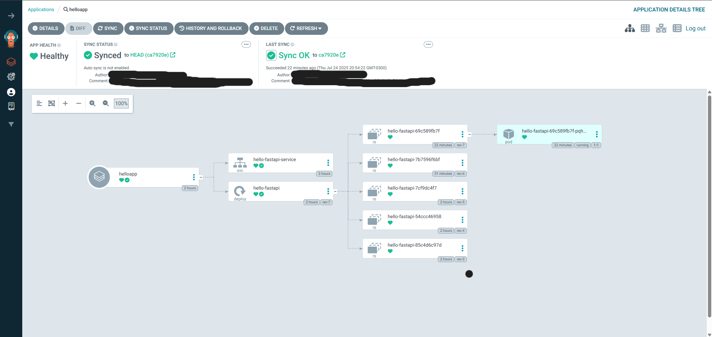

# Projeto: CI/CD com GitHub Actions

## Objetivo:

**Automatizar o ciclo completo de desenvolvimento, build, deploy e 
execução de uma aplicação FastAPI simples, usando GitHub Actions para
CI/CD, Docker Hub como registry, e ArgoCD para entrega contínua em
Kubernetes local com Rancher Desktop**

### Tecnologias ultilizadas:

- Rancher Desktop com Kubernetes

- Python 3 e Docker

- Git Actions

- ArgoCD

## Etapa 1: incluir o FastAPI e Criação do Dockerfile

**Crie um arquivo chamado "main.py" e cole o seguinte código:**

``` 
from fastapi import FastAPI
app = FastAPI()
@app.get("/")
async def root():
 return {"message": "Hello World"} 
 ```

 **Não esqueça de colocar os requerimentos necessário para o funcionamento do FastAPI**

[requirements.txt](/Projeto-CI-CD/requirements.txt)

**Já no Dockerfile coloque as seguintes linhas:**

```
FROM python:3.9-alpine3.20

WORKDIR /hello-app

COPY requirements.txt .

RUN pip install --no-cache-dir -r requirements.txt

COPY ./main.py .

EXPOSE 8081

CMD ["uvicorn", "main:app", "--host", "0.0.0.0", "--port", "8081"]
```

**Isso fará com que o FastAPI rode**

## Etapa 2: Repositório Git com os manifests do ArgoCD

```
```

## Etapa 3: Criar o GitHub Actions (CI/CD)

**Para criar o Git Actions você deve entrar no GitHub e ir até o repositório criado e procurar por ```Actions```. Dentro de actions você clica em ```set up a workflow yourself``` para você mesmo criar o seu actions**

```
name: CI/CD

on:
  push:
    branches: [ main ]

jobs:
  build-and-push:
    runs-on: ubuntu-latest
    steps:
      - name: Checkout code
        uses: actions/checkout@v3

      - name: Login to Docker Hub
        uses: docker/login-action@v2
        with:
          username: ${{ secrets.DOCKER_USERNAME }}
          password: ${{ secrets.DOCKER_PASSWORD }}

      - name: Build and push Docker image
        uses: docker/build-push-action@v5
        with:
          context: .
          push: true
          tags: ${{ secrets.DOCKER_USERNAME }}/hello-fastapi:${{ github.sha }}

  update-manifest:
    needs: build-and-push
    runs-on: ubuntu-latest
    steps:
      - name: Checkout manifests repository
        uses: actions/checkout@v3
        with:
          repository: ArleyGabriel06/hello-manifests
          token: ${{ secrets.GB_TOKEN }}
          
      - name: Atualizar imagem no YAML
        run: |
          sed -i 's|image: .*|image: '"${{ secrets.DOCKER_USERNAME }}"'/hello-fastapi:'"${{ github.sha }}"'|' deployment.yaml

      - name: Commit and push changes
        run: |
          git config user.name '${{ secrets.USER_NAME }}'
          git config user.email '${{ secrets.EMAIL_NAME }}'
          git add deployment.yaml
          git commit -m "Atualiza imagem para commit ${{ github.sha }}"
          git push
```

### 1. Gatilho (Trigger)

```
on:
  push:
    branches: [ main ]
```

**Sempre que houver um push na branch main, o workflow será executado automaticamente.**

### 2. Job: build-and-push

```
build-and-push:
  runs-on: ubuntu-latest
```

- **Esse job será executado em uma máquina virtual Linux na nuvem.**

#### 2.1. Checkout do código da aplicação:

```
- name: Checkout code
  uses: actions/checkout@v3
```

- **Clona o repositório atual (onde está o código do FastAPI) para a VM do GitHub Actions.**

#### 2.2. Login no Docker Hub:

```
- name: Login to Docker Hub
  uses: docker/login-action@v2
  with:
    username: ${{ secrets.DOCKER_USERNAME }}
    password: ${{ secrets.DOCKER_PASSWORD }}
```

- **Faz login no Docker Hub usando secrets que você definiu nas configurações do repositório.**

- ``` DOCKER_USERNAME = seu usuário no Docker Hub ```

- ``` DOCKER_PASSWORD = seu token ou senha ```

#### 2.3. Build e Push da imagem Docker:

```
- name: Build and push Docker image
  uses: docker/build-push-action@v5
  with:
    context: .
    push: true
    tags: ${{ secrets.DOCKER_USERNAME }}/hello-fastapi:${{ github.sha }}
```

- **Cria a imagem Docker com o código da aplicação.**

- **Usa como tag o hash do commit atual ``` (github.sha) ```, para garantir unicidade.**

### 3. Job: update-manifest

```
update-manifest:
  needs: build-and-push
```

- **Esse job só roda depois que o build-and-push terminar com sucesso.**

```
runs-on: ubuntu-latest
```

- **Também roda em uma máquina virtual Linux**

#### 3.1. Clona repositório de manifests:

```
- name: Checkout manifests repository
  uses: actions/checkout@v3
  with:
    repository: ArleyGabriel06/hello-manifests
    token: ${{ secrets.GB_TOKEN }}
```

- **Clona o repositório hello-manifests, onde está o arquivo deployment.yaml.**

- **O GB_TOKEN é um Personal Access Token do GitHub que permite fazer push nesse repositório.**

#### 3.2. Atualiza o nome da imagem no arquivo YAML:

```
- name: Atualizar imagem no YAML
  run: |
    sed -i 's|image: .*|image: '"${{ secrets.DOCKER_USERNAME }}"'/hello-fastapi:'"${{ github.sha }}"'|' deployment.yaml
```

- **Substitui a linha que contém image: dentro do deployment.yaml para colocar a nova imagem com a tag do commit atual.**

#### 3.3. Faz commit e push da atualização:

- **Configura o autor do commit (via secrets.USER_NAME e secrets.EMAIL_NAME).**

- **Comita a alteração no deployment.yaml.**

- **Faz push da mudança para o repositório hello-manifests.**

**Resultado esperado:**

- Cria e envia a imagem Docker nova para o Docker Hub.

- Atualiza o repositório de manifests com o novo nome da imagem.

- O ArgoCD (ou outro GitOps) vai detectar essa mudança e fazer o deploy automaticamente no Kubernetes.

## Etapa 4: Criação do App no ArgoCD

- **1. entre no ArgCD Localmente vá no ```New APP``` clique no mesmo e prencha com o nome desejado e cole o link do respositorio com os manifestos de ```deployment.yaml``` e ```service.yaml```, e sincronize os pods**

**Resultado Esperado:**



[Outros Resultados](entregas.md)
